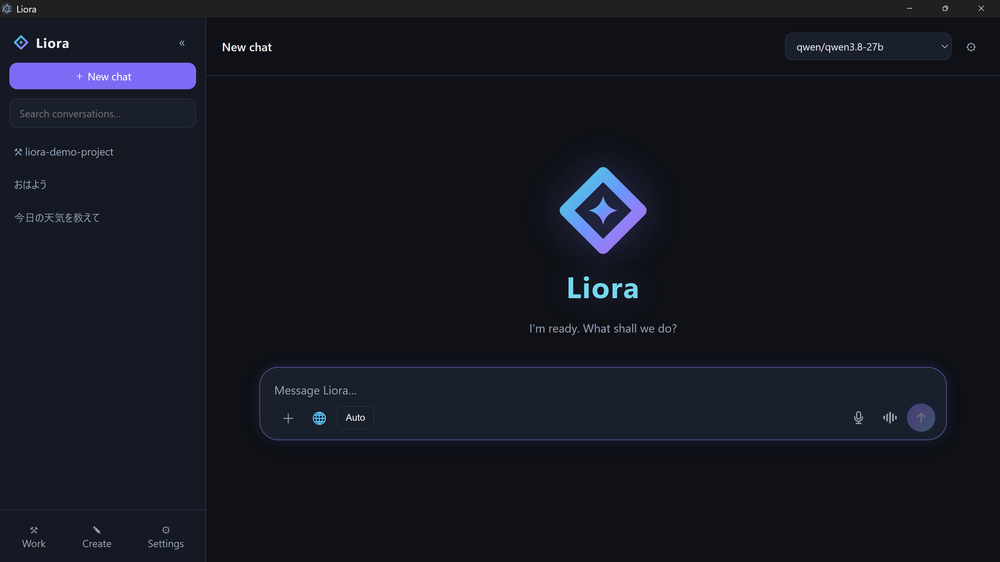
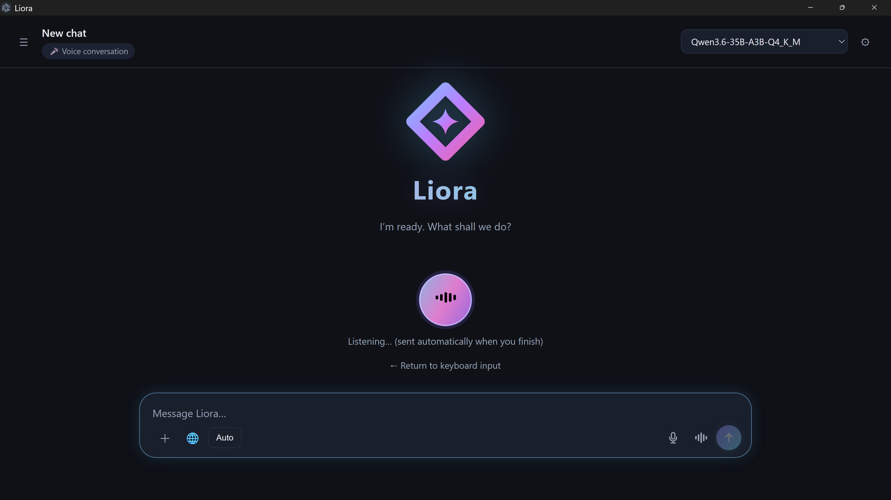
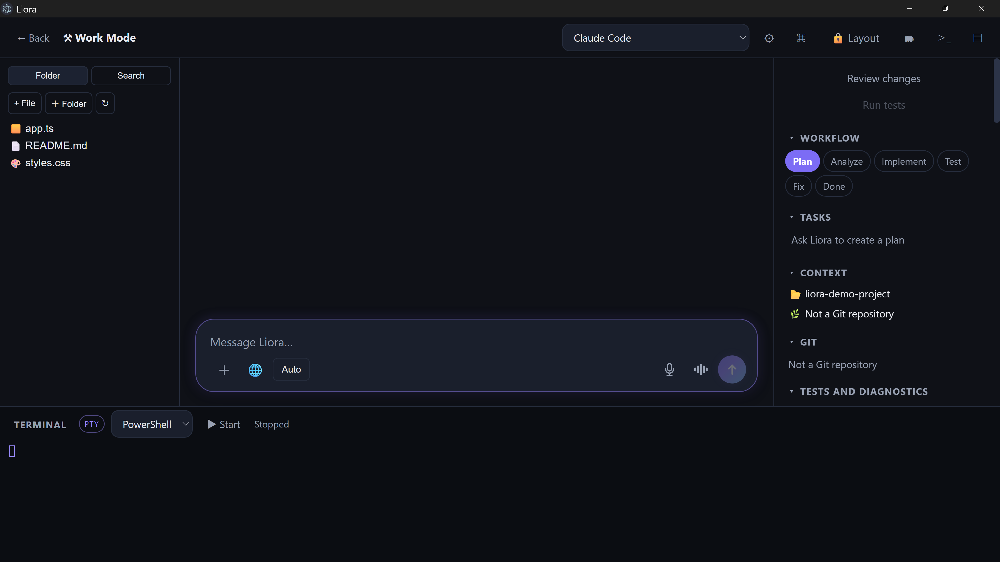
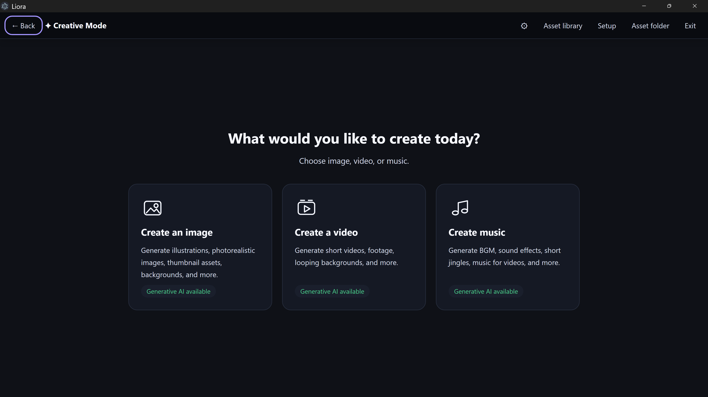
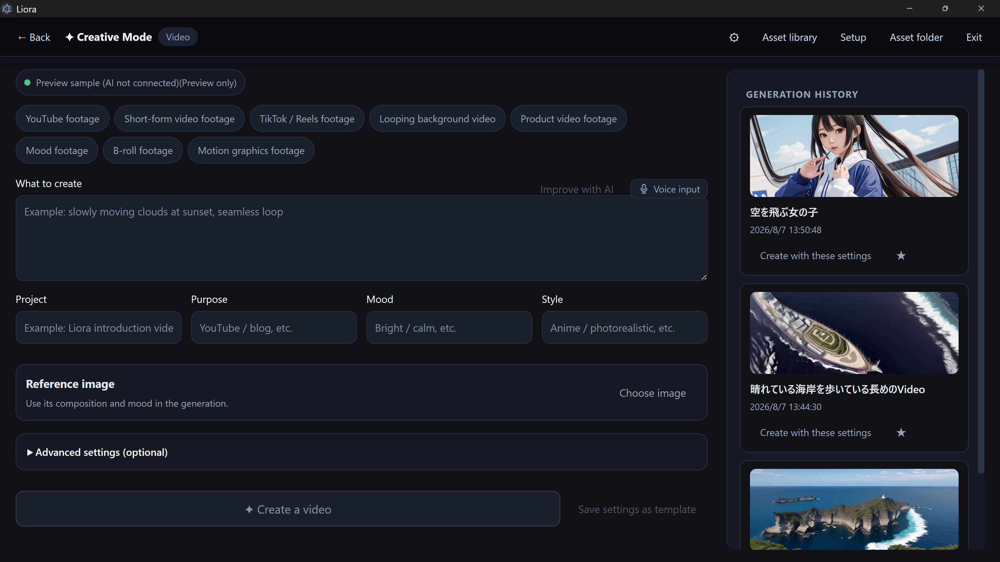

# Liora


**One Windows AI hub for conversation, development, creation, and everyday work.**

[日本語](README-ja.md) · [Official website](https://sainoweb.com/en/products/liora) · [Purchase](https://sainoweb.com/en/products/liora#liora-purchase) · [Support](SUPPORT.md)



Liora is a Windows AI hub from SAINO. It brings local AI providers, coding agents, voice, memory, web search, creative workflows, and PC tools into one desktop workspace.

Liora is designed for people who are comfortable installing Windows software, downloading AI models, and configuring local AI environments. A core usage guide and AI setup guide are included, but the product does not include individual remote installation or PC-specific configuration services.

## Highlights

- Switch between Ollama, LM Studio, llama.cpp, Codex, and Claude Code according to the task.
- Keep conversations, projects, long-term memory, document search, and web citations together.
- Use Work Mode for project files, plans, tasks, Git, tests, and terminal sessions.
- Use Creative Mode as an entry point for supported image, video, and music generation environments.
- Add speech recognition, speech output, MCP servers, skills, plugins, and automations when needed.
- Store conversations, memories, settings, and logs in Liora's local Windows application data.
- Diagnose optional services separately and start in Safe Mode when an external integration is unavailable.

See [the full feature overview](docs/features.md).

## Screenshots

### Chat and local AI selection


### Voice conversation



### Work Mode



### Creative Mode



### Creative video workspace



## Availability

Liora is commercial proprietary software for Windows 10 and 11. The official release is delivered through individual, time-limited private downloads rather than a public installer link.

- Japan: **JPY 29,800 including tax**
- International: **USD 199**
- Licence: one purchaser, for Windows PCs managed by that purchaser
- Delivery: an individual, time-limited download link and setup guide after payment confirmation
- Local AI models, cloud accounts, paid APIs, and third-party services are not included in the product price

Review the requirements, unsigned-installer notice, and terms on the [official SAINO product page](https://sainoweb.com/en/products/liora#liora-purchase) before purchase. Use the enquiry route while a checkout link is unavailable. The installer is not publicly hosted in this repository.

## Recommended users

Liora is recommended for people who:

- use Windows 10 or 11;
- can install Windows software themselves;
- want to configure local AI such as Ollama or LM Studio;
- can download and configure AI models; and
- can review error messages or diagnostic results when needed.

Read [system requirements](docs/system-requirements.md) before purchasing.

## Important installation notice

The current installer is **not code signed**. Windows SmartScreen may display an unrecognized-app warning. Verify the filename and SHA-256 checksum supplied by SAINO before deciding whether to continue. Do not disable Microsoft Defender or SmartScreen globally.

The verified SHA-256 for the current `1.3.0` installer is:

```text
380012943029FEC2B17B0863D8C1AC7BFE56408427AB48C2C505957FABE1BC43
```

See [installation and verification](docs/installation.md).

## Privacy and external services

Conversations, memories, settings, and logs are stored locally unless the user explicitly uses a connected cloud service or tool. Each external AI, search service, MCP server, CLI, and generation environment has its own account, data-handling, and fee conditions.

Read [privacy and security](docs/privacy-and-security.md) before using confidential material or enabling powerful PC-operation tools.

## Repository scope

This public repository contains product information, screenshots, and customer-facing documentation only. It does not contain the Liora source code, installer, internal prompts, non-public algorithms, build configuration, credentials, or development history.

Liora is proprietary commercial software.

Copyright © SAINO. All rights reserved.
